# Správa chemických vzoriek laboratória

__Škola__: Slovenská Technická Univerzita v Bratislave<br/>
__Fakulta__: Fakulta informatiky a informačných technológií<br/>
__Predmet__: Databázové systémy<br/>
__Študenti__: Bc. František Gič, Ján Šouc<br/>
__Cvičiaci__: Ing. Samuel Pecár<br/>

<div style="page-break-after: always;"></div>

## Špecifikácia
<p>
Systém vytvorený pre centrálne laboratória (FCHPT STU) na zjednodušenie práce s chemickými vzorkami.
Momentálne laboratórium funguje na princípy, že zákazník (študent, prednášajúci, cvičiaci) prinesie do laboratória vzorku, ktorú spolu s reportom odovzdá laborantovi.
V reporte je uvedené, čo je daná vzorka zač, v akom rozpúšťadle je rozpustená, meno zákazníka, či je daný zákazník samoplatca alebo sa diagnostika prepláca z nejakého grantu, množstvo atď.
Následne laborant prilepí na skúmavku jej číslo, a pokiaľ potrebuje vyhľadať informácie o danej vzorke, musí si prečítať daný report.

Náš systém zjednodušuje prácu ako laborantovi, tak i zákazníkovi.
Zákazník má možnosť sa do systému prihlásiť (registrácia je uzatvorená administrátorom), vytvoriť novú vzorku, vidieť zoznam svojich odovzdaných vzoriek, ako aj ich stav (či boli analyzované alebo nie).
Laborant ľahko vyhľadá detaily a informácie o vzorke podľa čísla na skúmavke, ktoré je vygenerované po vytvorení vzorky zákazníkom.

Celá špecifikácia je dostupná na [Wiki projektu](https://github.com/FIIT-DBS2020/project-gic_souc/wiki)
</p>

<div style="page-break-after: always;"></div>

## Implementácia

<p>

Projekt je napípsaný ako webová aplikácia.<br/>
Backend je napísaný v PHP Frameworku [Laravel 7](https://laravel.com)<br/>
Frontend bol pôvodne robený v JavaScript Frameworku [Vue.js](https://vuejs.org) ale z časového deficitu sme premigrovali na MPA verziu aplikácie.<br/>
Na FE používame taktiež CSS Framework [TailwindCSS](https://tailwindcss.com/)
a font ikoniek [Font Awesome 5](https://fontawesome.com/).<br/>
K administrácií chemických vzoriek používame [knižnicu JSME](https://peter-ertl.com/jsme/) od Peter Ertl a Bruno Bienfait.

</p>

<div style="page-break-after: always;"></div>

## Inštalácia
__Požiadavky__:
- PHP 7+
- Node.js & NPM - Na build frontend častí (transpilácia SASS do CSS)
- PostgreSQL
- Composer - PHP dependency manager

```bash
git clone https://github.com/FIIT-DBS2020/project-gic_souc/
cd project-gic_souc/src
composer install
npm install
```

Po nahodení databázy a importovaní dát dostupných v `db/db_dump.bak` spustiť server pomocou:

```bash
php artisan serve
```

<div style="page-break-after: always;"></div>

## Databázová štruktúra
### Entity

<div style="page-break-inside: avoid;">

#### User
User - je entita používateľa. Je to používateľ pridaný administrátorom do databázy.
Toto heslo od administrátora si môže dodatočne zmeniť.

</div>
<div style="page-break-inside: avoid;">

#### Rola
Tabuľka rola je číselníkom.
V aplikácií rozoznávame medzi 4 druhmi rolí

- __používateľ__
    - používateľ je bežný zákazník (prednášajúci, študent, cvičiaci) na fakulte
    - má možnosť vytvárať nové vzorky
    - meniť si heslo
    - vylistovať si svoje vzorky

- __garant__
    - garant je druh používateľa ktorý je zodpovedný za určitý grant
    - administrátor jednorázovo priradí grant
    - následne má garant možnosť vidieť všetky vzorky vytvorené s týmto grantom

- __laborant__
    - je zamestanec laboratória
    - dokáže vylistovať všetky vzorky v databáze, nezávisiac od toho komu patria
    - spracováva vzorky, vzorky bez laboranta si má možnosť priraďiť ak na nich pracuje
    - označuje vzorky ako spracované

- __administrátor__
    - vytvára používateľské kontá
    - upravuje vzorky, môže ich vymazať
    - môže vymazávať používateľov
    - spravuje vybavenie laboratórií, ako aj samotné laboratória

</div>
<div style="page-break-inside: avoid;">

#### Grant
Grant je druh fundovania daných vyhodnocovaní vzoriek. Pokiaľ vzorka nemá zvolený grant,
pre laboranta to znamená že od zákazníka pri prevzatí výsledkov musí zinkasovať sumu.
Pokiaľ idú peniaze z grantu, rieši sa to reportom na konci časového obdobia mimo systému.

</div>
<div style="page-break-inside: avoid;">

#### Status
Tabuľka status je číselníkom.
Status obsahuje vymenovanie rozličných statusov ktoré môže nadobúdať analýza v čase spracovania.

</div>
<div style="page-break-inside: avoid;">

#### Analysis
Analysis je entita laboratórneho úkonu. Drží informácie o stave spracovania vzorky,
priradeného laboranta, a kedy boli vytvorené zmeny (zmena stavu alebo laboranta). Taktiež obsahuje informáciu
o laboratóriu, v ktorom sa analýza vykonáva.

</div>
<div style="page-break-inside: avoid;">

#### Lab
Lab je laboratórium, fyzická miestnosť v ktorej sa vykonávajú analýzy. Laboratória spravuje administrátor a laboranti majú právo vybrať si dané laboratórium pri preberaní analýzy vzorky.

</div>
<div style="page-break-inside: avoid;">

#### Solvent
Solvent je rozpúštadlo v ktorom je daná vzorka. Rozpúštadla sú dané fixne administrátorom.
Pokiaľ je rozpúšťadlo špeciálne, daná relácia je označená ako `NULL` a rozpúštadlo musí byť vyplnené v poznámke.
Rozpúšťadlá spravuje - vytvára, mení iba administrátor.

</div>
<div style="page-break-inside: avoid;">

#### Spectrometer
Spectrometer sú zariadenia v laboratóriu. V aplikácií ich spravuje iba administrátor, pretože vybavenie laboratória sa nemení veľmi často.
Majú daný typ a názov. Každá vzorka je vyhodnocovaná určitým spektrometrom, ktorý si užívateľ navolí.

</div>
<div style="page-break-inside: avoid;">

#### Sample
Najdôležitejšia entita celej aplikácie. Vzorka je vytvorená v systéme a následne odovzdaná do laboratória.
Drží informácie o sebe ako názov (vybraný používateľom), množstvo (v ml), chemickú štruktúru,
informáciu o tom či ju majú z laboratória vrátiť alebo po analýze zahodiť, nejakú voliteľnú poznámku a časové údaje.
Vzorka môže byť taktiež platená z nejakého grantu, má priradeného laboranta, musí mať vybraté rozpúšťadlo a spektrometer.

</div>
<div style="page-break-inside: avoid;">

### Napĺňanie databázy dummy dátami

K napĺňaniu databázy sme použili feature PHP Frameworku Laravel s názvom [Seeding](https://laravel.com/docs/7.x/seeding) a [Factories](https://laravel.com/docs/master/database-testing#writing-factories).<br/>
Samotné seedery a factories sú dostupné v podpriečinku `src/database`.
K niektorým prvkom tabuliek sme použili Fake-dáta vygenerované PHP knižnicou [Faker](https://github.com/fzaninotto/Faker) ktorú používa Laravel na pozadí.

</div>
<div style="page-break-after: always;"></div>

### Logický dátový model
Logický dátový model sme navrhovali použitím nástroja [draw.io](https://app.diagrams.net/).
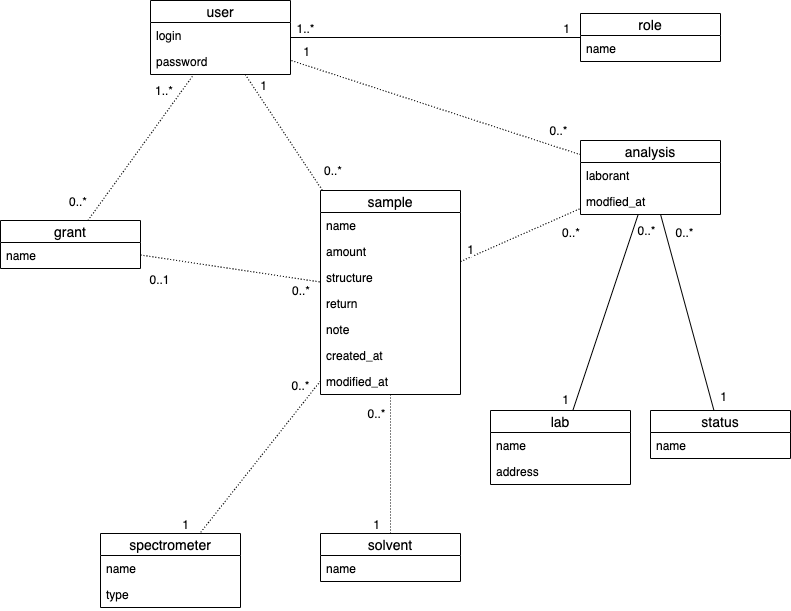

<div style="page-break-after: always;"></div>

### Fyzický dátový model
Fyzický dátový model sme navrhovali použitím nástroja [dbdiagram.io](https://dbdiagram.io/home).
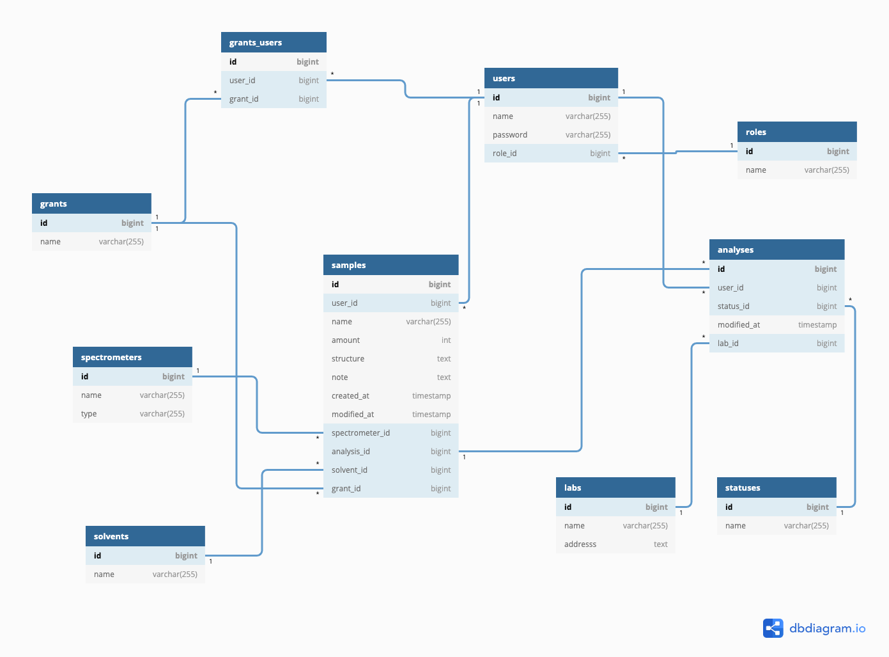

<div style="page-break-after: always;"></div>

## Scenáre

<div style="page-break-inside: avoid;">

### Autentifikácia

- __Milestone:__  [1. Odovzdanie](https://github.com/FIIT-DBS2020/project-gic_souc/milestone/1)
- __Issues:__
    - [#6 Make login great again](https://github.com/FIIT-DBS2020/project-gic_souc/issues/6)

<p>
Používateľovi je v tomto scenári umožnené prihásiť sa do
aplikácie pomocou vopred administrátorom vygenerovaného loginu a hesla.
Aplikácia si pamätá reláciu prihlásenia až do odhlásenia.
<br/> V rámci scenára je potreba prekopať Laravelovský login na custom riešenie.

_Debug credentials:_<br/>
__login:__ {rola}@test.sk<br/>
__supertajné heslo:__ nbusr123<br/>
_(Miesto role doplňte jedno z nasledujúcich - admin,garant,laborant,user)_

</p>
</div>
<br/>

#### Screenshoty
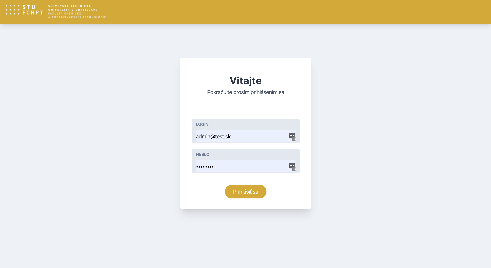

<div style="page-break-inside: avoid;">

### Zmena hesla

- __Milestone:__  [1. Odovzdanie](https://github.com/FIIT-DBS2020/project-gic_souc/milestone/1)
- __Issues:__
    - [#4 Implementovanie prvého scenáru](https://github.com/FIIT-DBS2020/project-gic_souc/issues/4)

<p>
Používateľovi je taktiež umožnené dané heslo zmeniť zadaním aktuálneho hesla a nového hesla + potvrdenie.
Heslo sa samozrejme musí zhodovať s aktuálnym. Základná validácia. Používateľ je po akcií informovaný o výsledku pomocou notifikácií.
</p>

</div>

#### Screenshoty
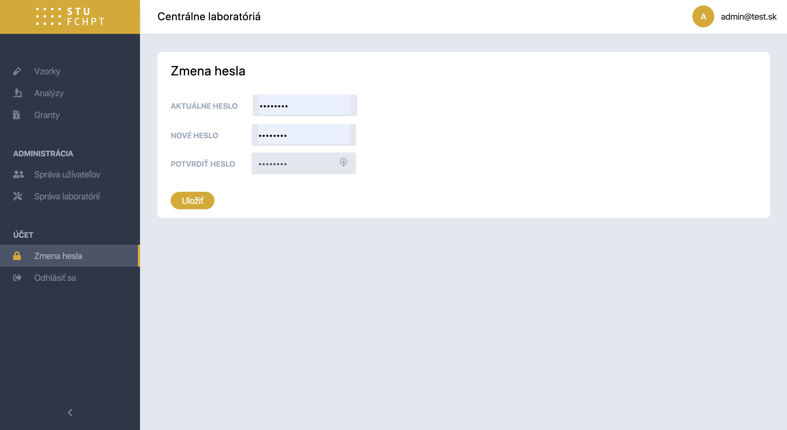

<div style="page-break-inside: avoid;">

### Vytvorenie novej vzorky

- __Milestone:__  [1. Odovzdanie](https://github.com/FIIT-DBS2020/project-gic_souc/milestone/1)
- __Issues:__
    - [#4 Implementovanie prvého scenáru](https://github.com/FIIT-DBS2020/project-gic_souc/issues/4)

<p>
Po kliknutí na tlačidlo nového záznamu v zozname všetkých vzoriek sa
sa používateľovi zobrazí formulár na vytvorenie novej vzorky.

Formulár používa [JSME Applet](https://peter-ertl.com/jsme/) na zjednodušenie reprezentácie chemickej štruktúry.
Používateľ je schopný vybrať si zo zoznamu grantov, rozpúštadiel a spektrometrov a uložiť svoju akciu.
Po uložení je notifikovaný o statuse uloženia daného záznamu (či bolo úspešné alebo nie) a následne môže vidieť svoj záznam ako posledný v zozname vzoriek.
</p>

</div>


#### Screenshoty
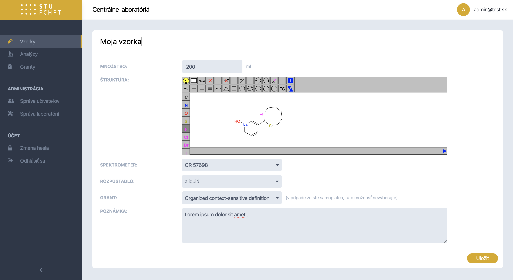

#### Query
```mysql
SELECT * FROM `spectrometers` WHERE id = :id;
SELECT * FROM `solvents` WHERE id = :id;
SELECT * FROM `grants` WHERE id = :id;
```

```mysql
INSERT INTO samples
(`name`, `amount`, `structure`, `note`, `solvent_id`, `spectrometer_id`, `grant_id`, `user_id`, `updated_at`, `created_at`)
values
(:name, :amount, :structure, :note, :solvent_id, :spectrometer_id, :grant_id, :user_id, :updated_at, :created_at);
```

<div style="page-break-inside: avoid;">

### List vzoriek

- __Milestone:__  [2. Odovzdanie](https://github.com/FIIT-DBS2020/project-gic_souc/milestone/2)
- __Issues:__
   - [#17 3. scenario - List of samples ](https://github.com/FIIT-DBS2020/project-gic_souc/issues/17)
   - Search
   - Pagination

<p>
Laborant je schopný vylistovať vzorky všetky vzorky laboratória,
zatiaľ čo používateľ listuje iba jeho vzorky.
Garanti vidia svoje vzorky a vzorky spadajúce pod ich granty.
</p>

</div>


#### Screenshoty
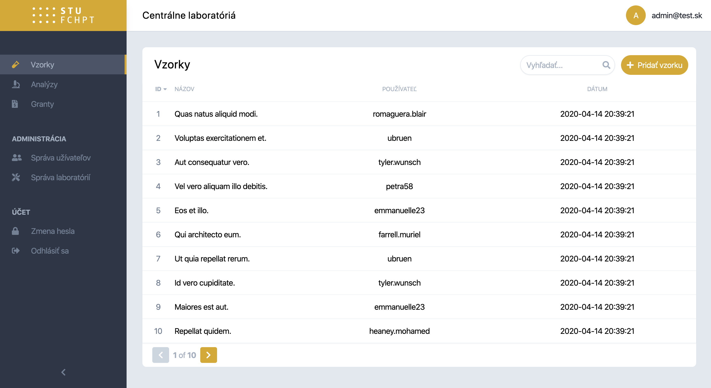

#### Query
```mysql
 SELECT
    s.id,
    s.name,
    u.login,
    s.created_at
FROM samples s
JOIN (users u) ON s.user_id = u.id
WHERE s.id LIKE :search OR u.login LIKE :search
ORDER BY :key :direction
LIMIT :limit OFFSET :offset;
```

```mysql
SELECT FOUND_ROWS() as count;
```

<div style="page-break-inside: avoid;">

### Detail vzorky

- __Milestone:__  [2. Odovzdanie](https://github.com/FIIT-DBS2020/project-gic_souc/milestone/2)
- __Issues:__
   - [#16 2. Scenario - Sample detail](https://github.com/FIIT-DBS2020/project-gic_souc/issues/16)

<p>
Všetky typy užívateľov majú možnosť vidieť detaily vzorky po vybratí zo zoznamu.
</p>

</div>


#### Screenshoty
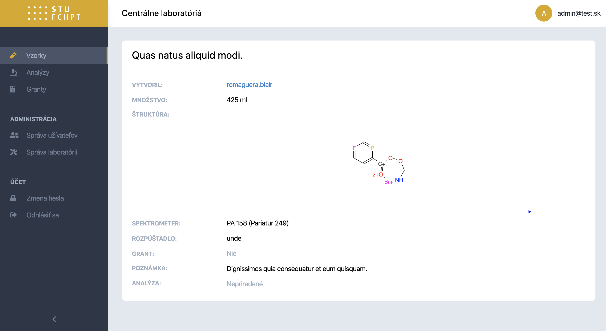

#### Query
```mysql
 SELECT
    s.id,s.user_id,u.login as user_login,
    s.name,s.amount,s.structure,s.note,s.created_at, s.updated_at,
    sp.name as spectrometer_name , sp.type as spectrometer_type,
    so.name as solvent_name,
    g.name as grant_name,
    s.analysis_id as analysis_id,
    st.name as analysis_status,
    u2.login as analysis_laborant_login
FROM samples s
LEFT JOIN spectrometers sp ON sp.id = s.spectrometer_id
LEFT JOIN solvents so ON so.id = s.solvent_id
LEFT JOIN grants g ON g.id = s.grant_id
LEFT JOIN analyses a ON a.id = s.analysis_id
LEFT JOIN users u ON u.id = s.user_id
LEFT JOIN users u2 ON u2.id = a.user_id
LEFT JOIN statuses st ON st.id = a.status_id
WHERE s.id = :id;
```

<div style="page-break-inside: avoid;">

### Administrácia laboratória

- __Milestone:__  [2. Odovzdanie](https://github.com/FIIT-DBS2020/project-gic_souc/milestone/2)
- __Issues:__
   - [#11 Show navigation items in the menu on the left conditionally](https://github.com/FIIT-DBS2020/project-gic_souc/issues/11)
   - [#15 Administration zone: Solvent, Spectrometer, Lab - CRUD](https://github.com/FIIT-DBS2020/project-gic_souc/issues/15)

<p>
Administrátor má v menu možnost spravovať laboratória, spektrometre aj rozpúšťadlá.
</p>

</div>


#### Screenshoty
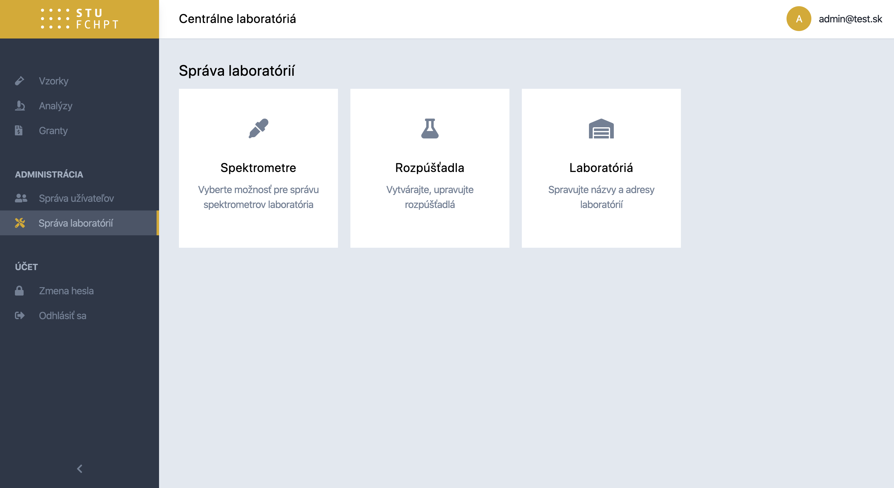

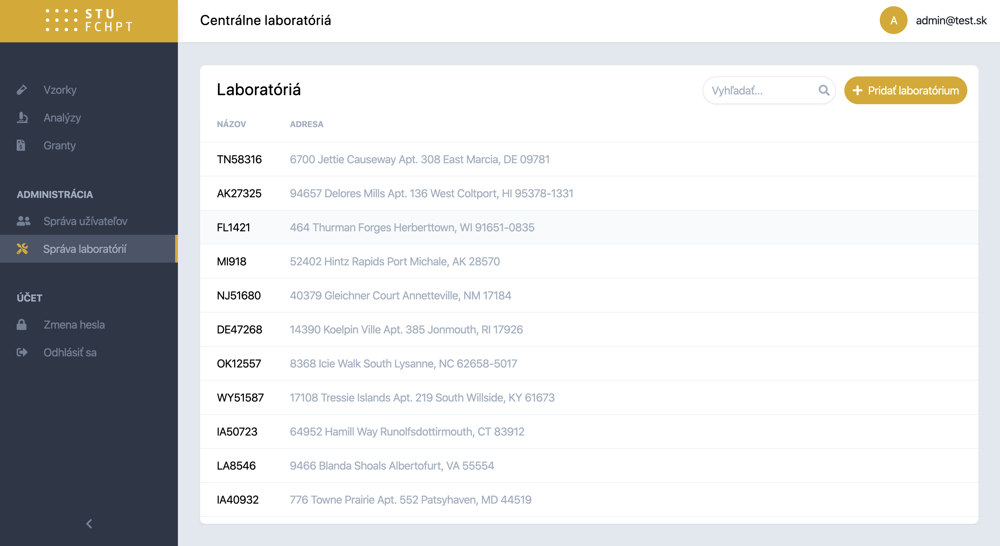

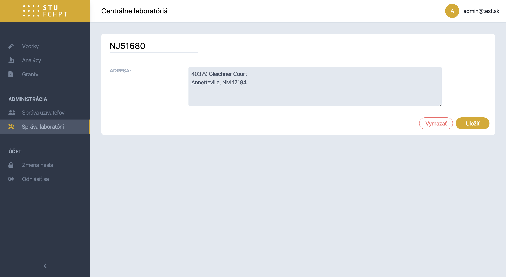

<div style="page-break-inside: avoid;">

### Zoznam používateľov

- __Milestone:__  [1. Odovzdanie](https://github.com/FIIT-DBS2020/project-gic_souc/milestone/1)
- __Issues:__
   - [#10 Implement first scenario](https://github.com/FIIT-DBS2020/project-gic_souc/pull/10/commits/b47eef5bdc760754ef19ad5746fb7a8f5f8108c9)


<p>
Administrátor v sekcií správa užívateľov vidí zoznam používateľov
spolu s počtom vzoriek ktoré vytvorili.
</p>

</div>

#### Screenshoty
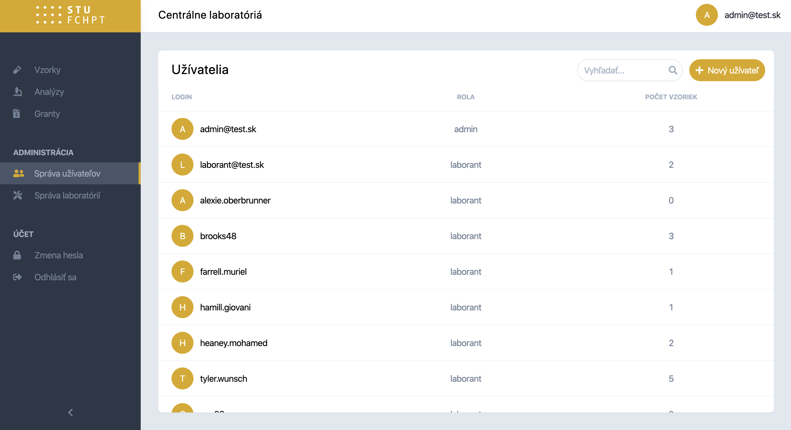

#### Query
```mysql
SELECT
    u.id,
    u.login,
    r.name as role_name,
    IFNULL(samples,0) as samples
FROM users u
JOIN roles r on r.id = u.role_id
LEFT JOIN (
    SELECT user_id, COUNT(1) as samples
    FROM samples
    GROUP BY user_id
)
smp ON smp.user_id = u.id
```

<div style="page-break-inside: avoid;">

### Detail používateľa

- __Milestone:__  [2. Odovzdanie](https://github.com/FIIT-DBS2020/project-gic_souc/milestone/2)
- __Issues:__
   - [#26 Implement advanced aggregation functions](https://github.com/FIIT-DBS2020/project-gic_souc/issues/26)

<p>
Administrátor v sekcií správa užívateľov
dokáže zobraziť detail používateľa.
Pokiaľ je prezeraným užívateľom laborant, v sekcií je vidno počet vzoriek, ktoré má priradené k analýze
a taktiež vidí priemerný čas týchto vzoriek, koľko mu trvá analýza
</p>

</div>

#### Screenshoty
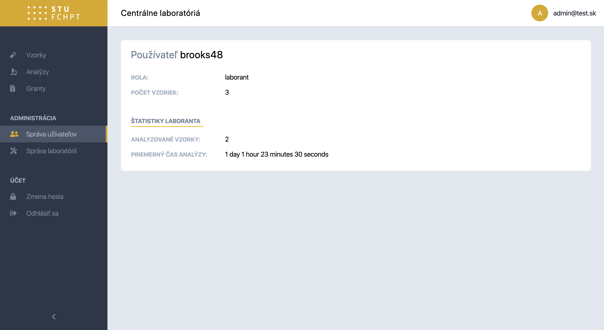

#### Query
```mysql
SELECT
    u.id, u.login,
    r.name as role_name,
    IFNULL(samples,0) as samples,
    IFNULL(analyses,0) as analyses,
    avg_timestamp
FROM users u
JOIN roles r on r.id = u.role_id
LEFT JOIN (
    SELECT
        user_id,
        COUNT(1) as samples
    FROM samples
    GROUP BY user_id
) smp ON smp.user_id = u.id
LEFT JOIN (
    SELECT
        user_id,
        COUNT(1) as analyses,
        ROUND(AVG(TIMESTAMPDIFF(SECOND,created_at,updated_at))) as avg_timestamp
    FROM analyses
    GROUP BY user_id
) a ON a.user_id = u.id
WHERE u.id = :id
```

<div style="page-break-inside: avoid;">

### Vytvorenie používateľa

- __Milestone:__  [3. Odovzdanie](https://github.com/FIIT-DBS2020/project-gic_souc/milestone/3)
- __Issues:__
   - [#33 Implement creating a new user](https://github.com/FIIT-DBS2020/project-gic_souc/issues/33)

<p>
Administrátor v sekcií správa užívateľov
dokáže vytvoriť nové užívateľské konto alebo existujúce konto editovať (login alebo zmeniť heslo v prípade zabudnutia)
Dôvod prečo toto robíme je, že aplikácia funguje na intranete a je uzavretá - registrácia nie je možná.
</p>

</div>

#### Screenshoty
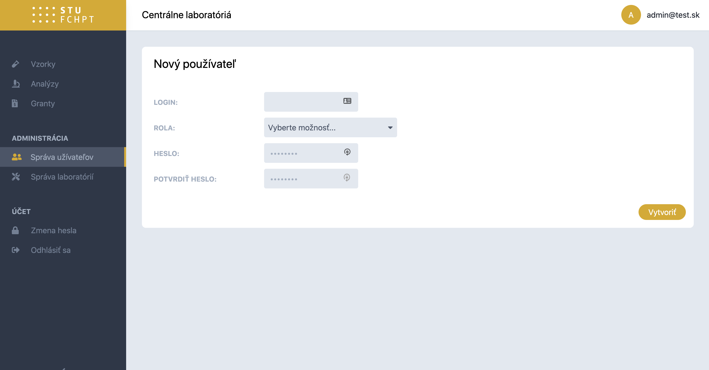

<div style="page-break-inside: avoid;">

### Prezvatie vzorky a rozbor

- __Milestone:__  [3. Odovzdanie](https://github.com/FIIT-DBS2020/project-gic_souc/milestone/3)
- __Issues:__
   - [#35 Implement analyses](https://github.com/FIIT-DBS2020/project-gic_souc/issues/35)

<p>
Laborant prevezme vzorku ktorá ešte nemá laboranta, označí ju ako rozpracovanú - že na nej pracuje.
Updatne sa čas modifikácie a o tomto stave je obozrejmený aj užívateľ.
Po dokončení laborant označí vzorku (labák) ako dokončený.<br/>

</p>

</div>

#### Screenshoty
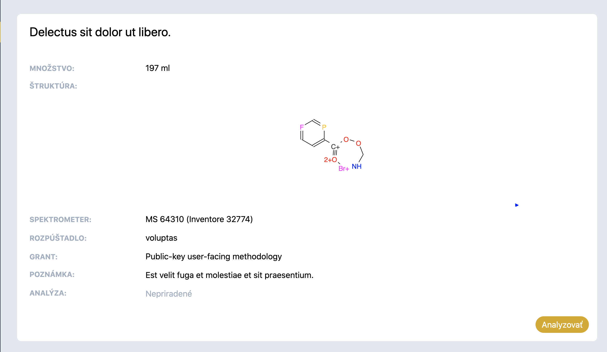

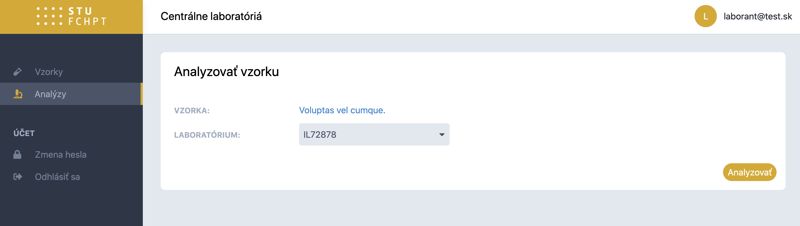

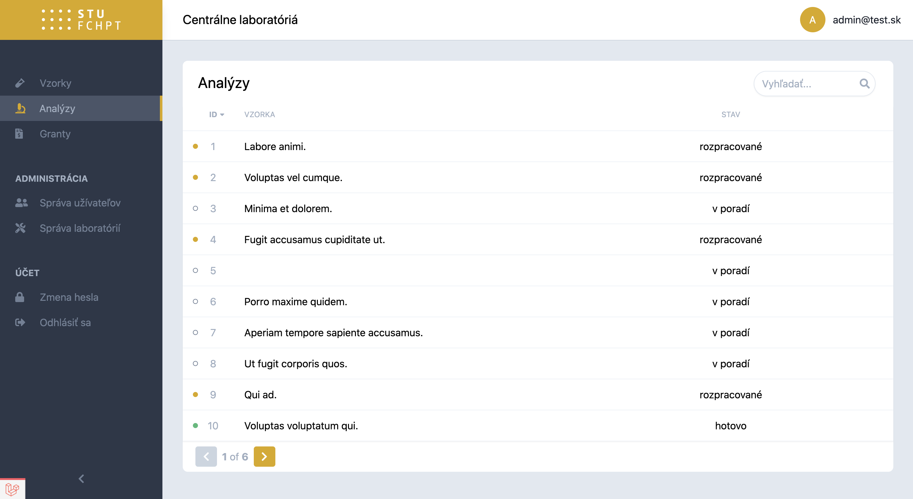

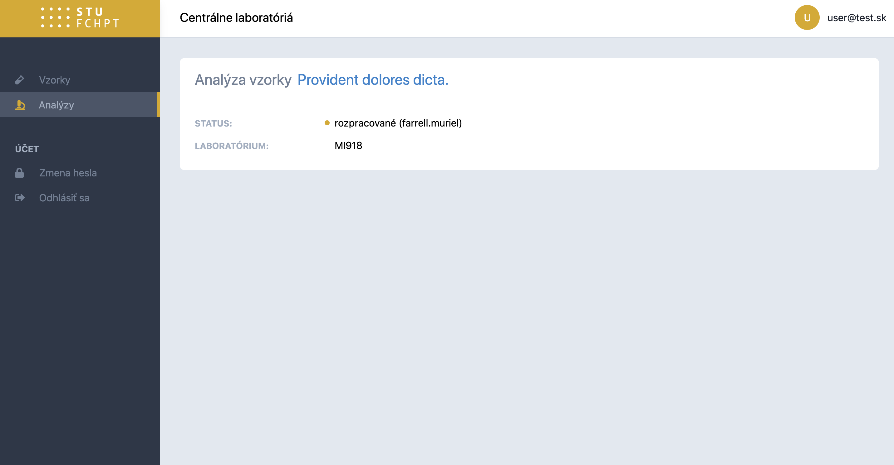

<div style="page-break-inside: avoid;">

### Upravovanie a vymazávanie vzoriek

- __Milestone:__  [3. Odovzdanie](https://github.com/FIIT-DBS2020/project-gic_souc/milestone/3)
- __Issues:__
   - [#38 Implement sample management](https://github.com/FIIT-DBS2020/project-gic_souc/issues/38)

<p>
Táto akcia je dostupná iba administrátorovi (aby sa nestrácali a nemdifikovali vzorky)
Má možnosť pristúpiť k edit pohľadu vzorky, upraviť ju alebo vymazať.
</p>

</div>

#### Screenshoty
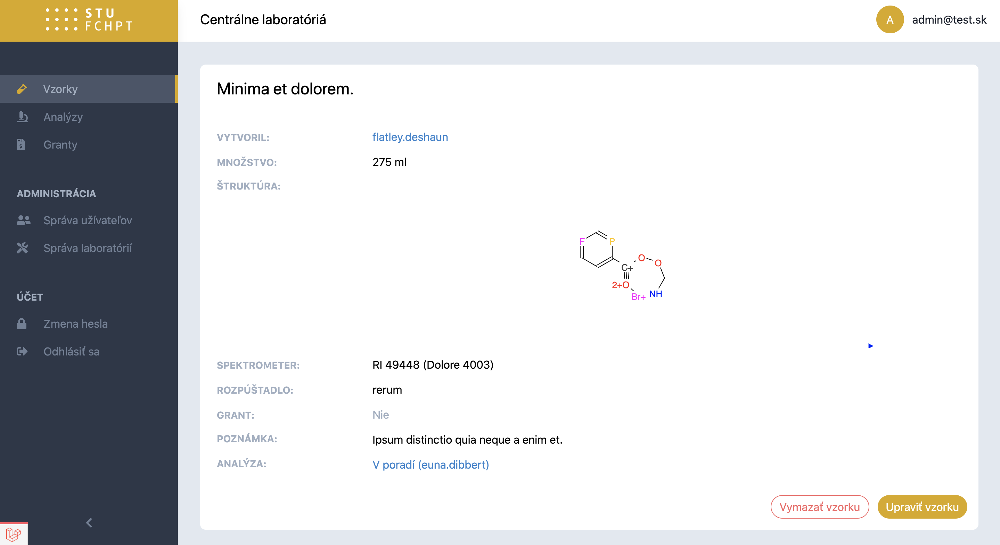

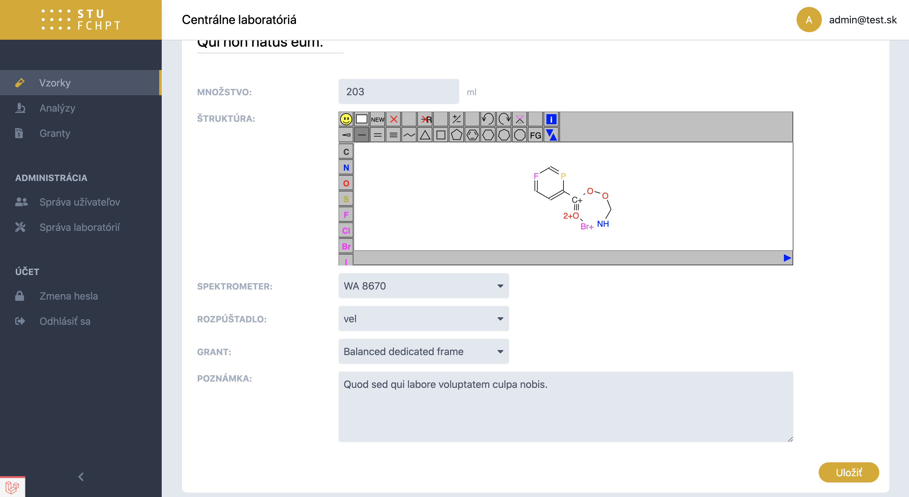
